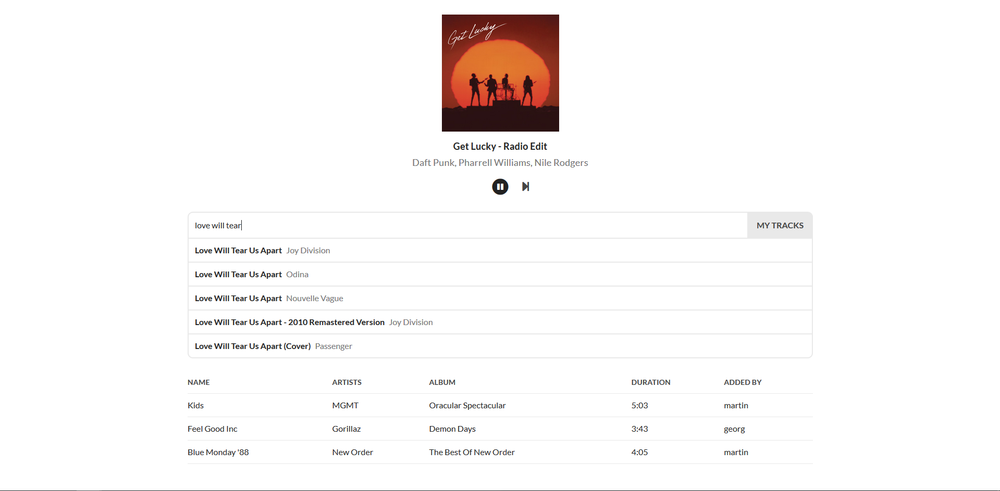

# Jukebox



Jukebox is a small app that allows multiple users to control one Spotify playback. It takes turns correctly, so that each user can listen to the same amount of proposed songs. It uses [socket.io](https://socket.io/) to keep everyone in sync and [Hyperapp](https://hyperapp.js.org/) to render the state changes in the frontend.

## Installation

```
# clone the repo
git clone https://github.com/georgdonner/jukebox.git

# change dir
cd jukebox

# install all dependencies
yarn install
```

## Setup

- Create a new application in the [Spotify Developer Dashboard](https://beta.developer.spotify.com/dashboard/applications).
- There, click on **Edit Settings** and add `http://localhost:8000/token` as the **Redirect URI**.
- Create a file `.env` at the root of the directory and add the credentials like so:
```
CLIENT_ID=243875098324jf9pj9n84ru
CLIENT_SECRET=jf9834h098fh9h4f8z43h9fs8h349
SESSION_PASSWORD=mypassword
```
- Authorize your Spotify account and start the server:
```
# start the auth setup
yarn setup

# go to http://localhost:8000 and authorize your account

# build the project
yarn build

# start the server
yarn start

# see the app live in action at http://localhost:8000 🎉
```